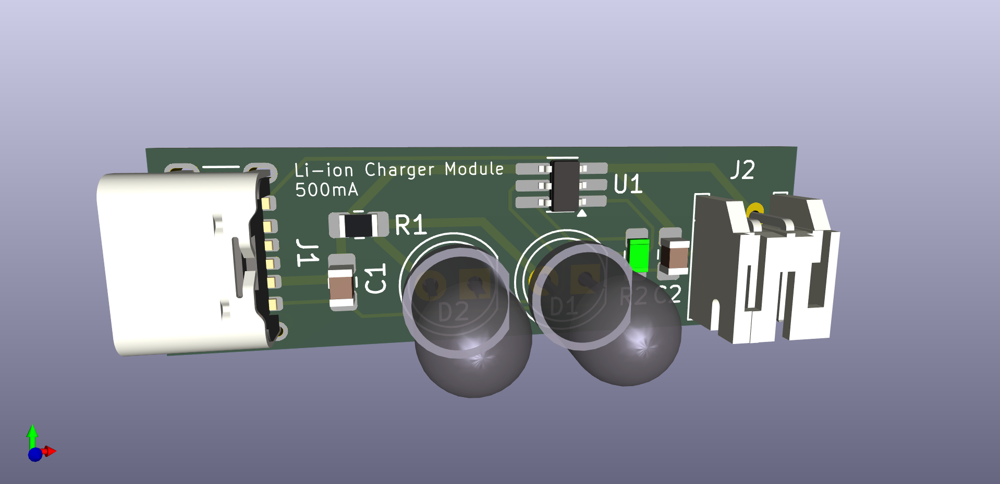

# Lithium-Ion-Battery-Charging-Module
500mA Lithium Ion battery linear charging module capable of charging up to 4.7v.

TP4057 IC provides following features:
-  Reverse polarity application protection
-  Constant charging current/voltage regulation
-  Charge status indicators
-  Preset charge voltage within 1% accuracy
-  C/10 Charge termination

INPUT VALUES
-  Voltage: 4v to 9v
-  Current: 0mA to 500mA 

